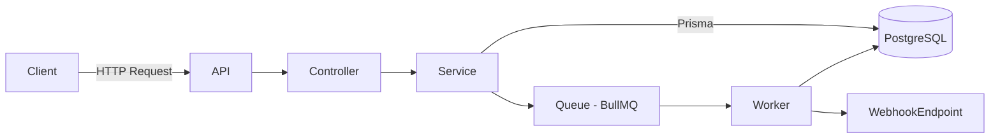
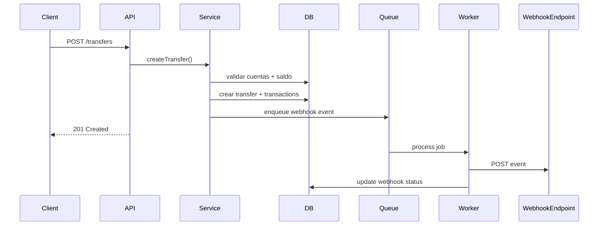
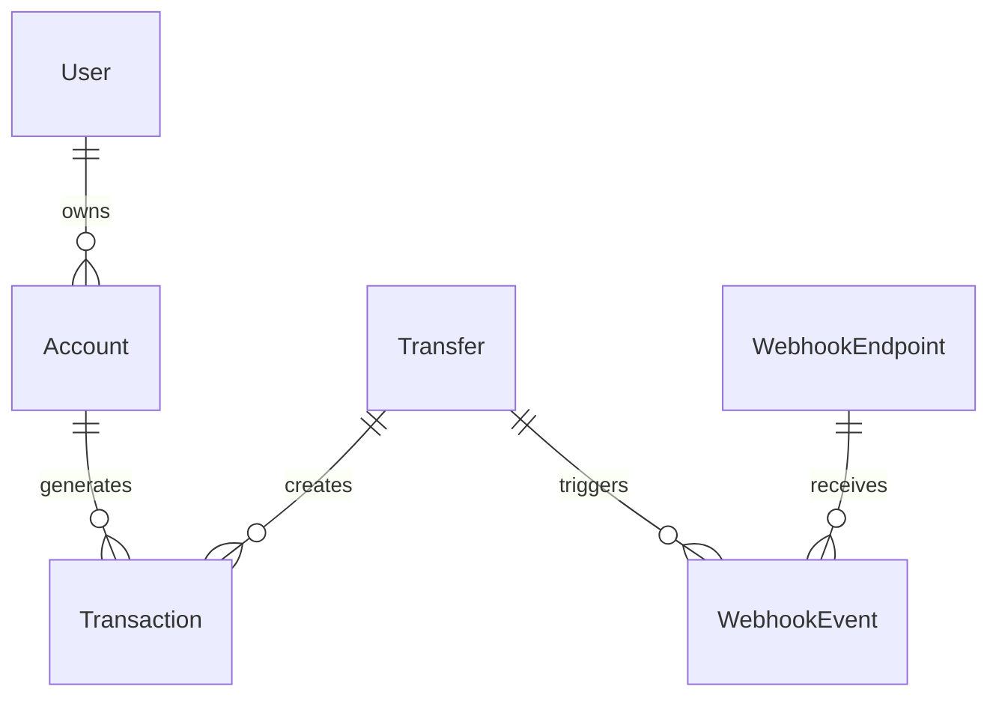

# 🚀 PayCore Backend

Backend de procesamiento de transferencias financieras diseñado con arquitectura moderna, idempotencia, webhooks y analytics operacionales.

---

# 📌 Overview

PayCore simula un sistema tipo **PSP (Payment Service Provider)**, enfocado en:

* Procesamiento seguro de transferencias
* Idempotencia estilo Stripe
* Webhooks asincrónicos
* Analytics en tiempo real
* Alertas inteligentes
* Observabilidad completa

---

# 🧱 Arquitectura



---

# 🔁 Flujo de Transferencia



---

# ⚙️ Stack Tecnológico

* Node.js (ES Modules)
* Express
* PostgreSQL
* Prisma ORM
* Redis
* BullMQ
* JWT
* Pino (logging estructurado)
* Jest + Supertest (testing)

---

# 🔐 Autenticación

* JWT Access Token
* Refresh Tokens persistidos
* Roles y estados tipados con enums

---

# 💸 Transfers

## Features

* Validación de cuentas activas
* Control de saldo
* Transacciones atómicas (ACID)
* Registro de movimientos (DEBIT / CREDIT)

## Idempotencia

Header requerido:

```http
Idempotency-Key: unique-key
```

### Comportamiento

| Caso            | Resultado   |
| --------------- | ----------- |
| Primera request | 201 Created |
| Repetida        | 200 OK      |
| Mismo ID        | ✔           |

---

# 🔁 Webhooks

## Funcionalidades

* Registro dinámico de endpoints
* Dispatch automático de eventos
* Retry manual
* Tracking de estado
* Firma de seguridad HMAC por endpoint

## Eventos

* `transfer.created`
* `transfer.completed`

## Seguridad

Cada webhook enviado incluye una firma en el header:

```http
X-PayCore-Signature: <hmac_sha256_signature>
```

La firma se genera usando el `secret` del endpoint, permitiendo:

* validar autenticidad
* verificar integridad del payload
* prevenir requests maliciosas

---

# 📊 Analytics

## Endpoints

```http
GET /api/analytics/summary
GET /api/analytics/top-accounts
GET /api/analytics/alerts
GET /api/analytics/insights
GET /api/analytics/transfers
GET /api/analytics/webhooks
GET /api/analytics/transfers/timeline
GET /api/analytics/transfers/recent-failures
GET /api/analytics/webhooks/recent-failures
GET /api/analytics/smart-alerts
```

## Métricas

* volumen total transferido
* tasa de éxito / fallo
* performance de webhooks
* concentración de cuentas
* detección de anomalías
* timeline de transfers
* fallos recientes
* insights operacionales

---

# 🚨 Alertas Inteligentes

Detecta automáticamente:

* alta tasa de fallos
* transfers pendientes
* transfers anormalmente grandes

---

# 📈 Observabilidad

Logging estructurado con **Pino**:

* requests HTTP
* errores
* autenticación
* workers
* webhooks

---

# 🧪 Testing

Cobertura completa con:

* Jest
* Supertest

## Casos cubiertos

* health check
* auth (login)
* transfers
* idempotencia
* analytics
* webhooks

---

# 🗄️ Modelo de Datos



---

# 🚀 Cómo correr el proyecto

## 1. Instalar dependencias

```bash
npm install
```

## 2. Variables de entorno

```env
DATABASE_URL=
JWT_SECRET=
REFRESH_TOKEN_SECRET=
```

## 3. Levantar Redis

```bash
redis-server
```

## 4. Migraciones

```bash
npx prisma migrate dev
```

## 5. Ejecutar

```bash
npm run dev
```

---

# 🧪 Ejecutar tests

```bash
npm test
```

---

# 📄 API Reference

Base URL:

```http
http://localhost:3000/api
```

---

## 🔐 Auth

### Login

```http
POST /api/auth/login
```

```json
{
  "email": "ignacio@example.com",
  "password": "Password123"
}
```

---

## 💸 Transfers

### Create Transfer

```http
POST /api/transfers
Authorization: Bearer <token>
Idempotency-Key: unique-key
```

---

## 🔁 Webhooks

### Register Endpoint

```http
POST /api/webhooks/endpoints
```

### Retry Event

```http
POST /api/webhooks/events/:eventId/retry
```

---

## 📊 Analytics

### Summary

```http
GET /api/analytics/summary
```

---

# 📌 Decisiones Técnicas

* Idempotencia estilo Stripe
* Transacciones ACID con Prisma
* Arquitectura desacoplada (colas)
* Logging estructurado
* Dominio tipado con enums

---

# 🔮 Futuro / Escalabilidad

* rate limiting
* circuit breakers
* Prometheus metrics
* dashboard frontend
* microservicios

---

# 👨‍💻 Autor

Ignacio Bruno
Backend Developer (Fintech-oriented)

---
